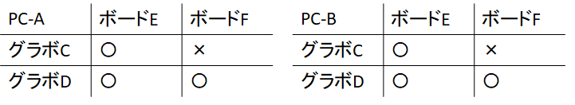
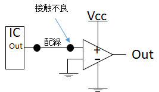

# 原因不明の不具合と「相性」

「相性」という言葉を聞いたことはありますか？性格の一致不一致とか、一緒にいて気が楽とか、人間間ではそういう表現・文脈でも使われますが、電子工作に限らず、工業製品一般に使われる用語です。ただし、何となくうまく動かないときなどに言い訳的に使われることもあります。そして、電子工作においては、何かミス、あるいはマージンを削っている状況が原因にあることが少なくありません。ですが、原因究明に苦労することは多く、それは電子工作の醍醐味の一つではありますが、挫折原因の筆頭になることもあります。相性がある場合もありますが、相性と片付けず、頑張って追及しましょう。

本章では、この「相性」について触れます。ただし、相性問題をきちんと突き詰めることは非常に難易度が高い場合があります。原因がはっきりしないからこその「相性」でもあります。それでも、「そういうこともある」ということを知っているのと知らないのでは大違いです。

## 相性とはなにか？
パソコンなどの電子機器において、規格上は動作するのに、特定の組み合わせでは動作しない、不安定になる、といった状況を相性と呼びます。

まずは、パソコンにおける相性の例を取り上げ、簡単に解説しましょう。パソコンのボード、ドライバ、ソフトウエアはそれぞれ広く知られた規格や規定に合致するように作られています。50年以上前の初期の「パソコン」にはたくさんの独自規格があったため、基本そのメーカーの専用だったりしたこともありますが、PC/AT互換機と呼ばれるような1990年前後より新しいパソコンでは、規格の統一が進んできて、（建前上は）深く考えずとも接続、使用できるようになりました。それでも、「相性の悪い」組み合わせというものはありました。「PCIバス用」のボードなのに、PCIバスに挿しても動かない、PCが途中でハングアップする、などの症状が出ることがあり、「相性がキツい」といった表現をされることがありました。原因が「相性」である不具合が発生するとき、そのデバイス・パーツ単体は正常です。パーツが故障している、不良品であるというわけではありません。ところが、正常なパーツA（例えばマザーボード）と正常なパーツB（例えばグラフィックボード）を組み合わせて使うと、不具合が出るのです。また、マザーボードとグラボのように直接接続する場合のみではなく、ボード同士の相性という場合もあり、例えばグラボ単体、キャプチャボード単体では動くのに、特定のグラボとキャプチャボードを2枚同時に挿すと不具合が出る、といったこともあります。

相性が発生する原因はいくつかあり、基本的には、製造メーカーの間で規格の解釈が食い違っていたり、検証不足だったり、またマージンが少なかったりすることが挙げられます。動作のタイミングがシビアであるとか、大容量のデータを流すなどの場合に相性が出やすくなります。また、ノイズ対策や電源周りが貧弱だとかいったことが原因のこともあります。高速・大量のデータを扱うグラフィックボードやビデオキャプチャボード、メモリなどは相性が出やすいパーツです。また、独自機能・独自設計を盛り込むことが多いデバイスも、相性が出やすいでしょう。メーカーの検証不足という点では、世の中のすべてのメーカーのすべてのパーツについて網羅的に検証することは不可能です。パーツの組み合わせだけでも組み合わせ爆発が生じるのに、さらに「使い方」まで含めると、検証は不可能です。

相性問題が生じた場合、原因追及は困難を極めることが少なくありません。原因が明確でないからこそ、試行錯誤的にトライする必要があります。単体パーツの動作検証は比較的簡単です。そして、その検証結果は「正常」です。そうなると、不具合の原因は不明となってしまいます。不具合の出る組み合わせがわかればまだHappyです。

PCパーツはたいていの場合比較的高価で、複数持っていることもあまりありません（逸般の誤家庭では予備パーツも含めてありますけど）。ですから、動作検証や不具合切り分け、クロスでのチェックなどはかなり大変です。先の例で挙げましたが、あるグラボとキャプチャボードを同時に使うと相性が出るとします。この時に、PC、グラボ、キャプチャボードが2セットあったらどうでしょう？それぞれクロスでチェックして、原因の切り分けができることがわかります。

ここで一つの思考実験です。PC-AとPC-Bがあり、グラボCとグラボD、キャプチャボードEとキャプチャボードFがあり、グラボCとキャプチャボードFを使ったときに相性による不具合が出るとしましょう。8通りすべてチェックできれば、それぞれの部品が正常で、かつ、グラボCと、ボードFの組み合わせにおいて不具合が生じる（＝相性がある）ということが確認できます。また、PC―Aだけで発生するのか、PC-Bでも発生するのか、といったように一般化していき、不具合が出る条件を探すことができます。この例ではPC―Bでも同様に発生するので、グラボC-ボードFの相性だと結論づけられますが、PC-Aだけだと、実はここに登場しないデバイスZとの3者の相性である可能性もあります。このように、「怪しいもの」を追い込むことはできても、確定させることは非常に難しいのです。

確定のためには、例えば、PCIバスの波形を直接検証して、グラボCとボードFの時だけ通信データに不具合(例えばデータ化け)が出ることを証明する必要がありますが、現実的ではありません。

## 電子工作における不具合の調査・究明

電子工作において、うまく動作しないという現象が発生することがあります。むしろ、たいていの場合きちんと動きません。明確な原因がわからないけれど、動かなかったり、動作が不安定だったりする現象が生じたとき、その原因追及を頑張るのですが、電子工作においても、その解決は大変困難です。素子の故障の場合も、ミスの場合も、相性の場合もあります。

調査が難しい原因をいくつか取り上げましょう。

### 現象が目に見えない

作ったものが正常に動いているのか、そうでないのか、どこに不具合があるのかを知ることが解決への最初の一歩です。ところが、複数の要素があるなかで、そのどこに不具合の原因があるのかを突き止めるのは非常に難しい場合があります。むしろ、どこに不具合があるのかが分かった時点で、問題は半分以上解決しているといえるでしょう。

電子工作において、現象がみえることは稀です。電気は目に見えません。信号も目に見えません。通信も。ある種、入出力しかわからない、いえ、入力すらよくわからない何層もあるブラックボックスを、出力だけから推定する必要があるのです。

そこで測定器を使うのです。出力しかわからないところを、入力もわかるようになる、処理の途中の状態がわかるようになる、電源や接続状況が確認できるなど、ブラックボックスの中を少しづつみえるようにしていきましょう。

### 測定器がない
現象を可視化するためのツールが測定器です。目に見えない電圧を目に見えるようにするため、テスタやオシロスコープがあります。単純な電圧ならテスタ、波形含めて見るにはオシロスコープなどがあると問題解決の大きな手助けになるでしょう。より高次の情報を得るためには、ロジックアナライザやプロトコルアナライザと呼ばれる装置を使うこともあります。趣味の電子工作でそこまで行くことは稀かもしれませんが。

逆にいうと、測定器なしに問題解決するのは非常に大変です。暗闇の中手探りで、あるいは手探りですらなく、暗闇の迷路を、壁にぶつかるか通り抜けるかの2択チャレンジを延々と繰り返すようなものかもしれません。測定器があると便利ですよ、という記述が本書には何度か出てきますが、みえないものをみえるようにする点で、測定器は暗闇を照らす松明足りえます。最初から一気にすべてをそろえる必要はありませんが、機会と必要があれば順次そろえていけるといいですね。

なお、前述の記述と矛盾するようですが、測定器があれば万事解決するかというと、そういうわけでもありません。

例えば、接触不良が疑われる状況があったとしましょう。テスタを持ってきて測定してみます。問題解決の第一歩ですね。テスタを用いる目的は、ケーブルがきちんと導通しているか、逆に導通してはいけないところがきちんと絶縁されているか、を確かめることです。確実に導通しているかは、人の目では見ることができません。その方針自体はきわめて正しいものです。

ところが、微妙な接触不良やショートは、テスタを当ててみても導通チェックでは音が鳴るかならないかでしかわかりませんし、テスタを当てることで微妙な接触不良が押し込まれ、テスト時だけ完全に導通しているということが生じえます。

はんだ不良（いわゆる芋はんだやはんだの割れ）のように、見た目でもわからないし、直接触ってしまうと状況が変わるという事象はあります。

また、オシロをつなぐことでGNDの取り方が変わって挙動が変わるということもありえます。入力インピーダンスが高い回路などで不定になってしまうことなどあり、オシロを接続してないときは動作が不安定になり、オシロを接続することで、実質的にGNDが「たまたま」安定したため動作するようになる、外すと動かない、といった現象に直面するのです。適切にプルアップ/プルダウンしましょう、という回答になるのですが、これらも測定器があるから挙動が変わるという一例です。

こういった現象の対応として、テスタによる導通の例では、例えば両端で測定するといったことをやってみるとよいでしょう。

動作が不安定な回路があったとします。ICの出力と、それを受けるオペアンプがあり、その間をつなぐ配線があったとしましょう。そして、配線の右側に接触不良があったとします。

その導通を測定する時、オペアンプ側の接点で導通を見たらどうでしょう？接触不良部を押し込んで導通が取れてしまうと想定できます。

もちろん、逆側が接触不良の可能性もあります。

ですから、両方の接点をテスタで当たって、接触不良の有無を確認するなどの対応が必要になります。**逆側の接点でも**確かめることで、押し込んで導通が取れてしまうことを回避しつつ、導通のチェックができました。もちろん、毎回毎回2か所両方確認しなければならない、というわけではありません。ただ、「そういうこともあるかもしれない」という心づもりがあれば、チェック漏れ、あるいは原因の見逃しを防ぐことができます。

### 部品単体テストが難しい
たいていの電子機器は、それ単体で動作します。スマフォなら、電源が入るか、電話はかかるか、ブラウジングできるか、音が出るか、など単体で様々なチェックができます。電源が入り、OSが起動するが、音が出ない、となれば、音周りで何か不具合、設定ミスがあることがわかります。

しかし、電子工作において、その素子が壊れていないか、という確認をすることはかなり大変です。抵抗やコンデンサなどは、規定の容量があるかをテスタでチェックすることができますが、ICレベル、あるいはそれ以上の素子、またはセンサなどになると、テスタで簡単にチェックするということが難しくなります。また何かに組み込んでテストしてみようにも、マイコンのテストコードを書いてみるがコードが正しい保証がないとか、その配線はどうする？配線まちがってないか？接触不良はないか？など、構成要素による不具合と、素子そのものの不具合が両方起こりえます。結果として、動かなかったとして、何が悪いのかやっぱりわからない、ということが生じます。単体ではチェックできないのに、複数の要素があってどれが原因なのかわからないという矛盾した状況が容易に発生します。

### 試行錯誤のうちに壊す、焼ける

何かを作ってみました。動作検証をしたところうまく動いていないようです。回路がおかしいのかな？コードがおかしいのかな？接触かしら？結線ミスは？とりあえず一回チップ外してやり直してみようか。コードのここ書き換えて。この配線間違えた気がする。あ、パターンはがれた。ちーん。

あてずっぽうでいろいろ修正、試行錯誤しているうちに、コードのどこを直したのかわからなくなってしまう、はんだ付けのパターンを剥がしてしまう、切ってしまう、素子が熱でやられる、ピンが折れる。

そして、最後に**心が**折れます。

### はんだ不良・接触不良
はんだ不良も割とよくある不具合です。古いはんだ付け部が割れていたりすることもあります。ワニ口クリップのはんだが両側で割れていた（使いまわしだったので元からかもしれません）ことに遭遇したことがあります。抵抗値が出たりでなかったりする、という現象ですが、コネクタの方の不良を疑ってだいぶ時間を食ってしまいました。しかも、1本のワニ口の「両方が」はんだ不良だなんて想像もしませんよね。でも案外よくあることです。

はんだ付け自体、非常に奥の深い技術で、それだけで本になるレベルですが、そこまでいかなくても、接触不良は、非常によくある不具合原因の一つです。従来の電子工作であれば、ノイズがのるとか、ついたり消えたりする、のように現象として見ることができましたが、最近のマイコン基板をベースにした電子工作では、通信が成立しないとか、マイコンがリセットするといったことが起こるため、全く動かない、という状況に直結します。

はんだ付けのチェックは、目視では見えづらいこともありますが、よく確認し、場合によっては、はんだごてで一度なぞって溶かしなおしておく、といった対策も有効かもしれません。

### 相性はある
動かないうちのたいていの場合は、何らかのミスです。しかし、「相性」に近い現象もときどき、あるいは頻繁に起こります。電子工作における相性の発生原因の相当の部分は、電源に起因します。

特に、USBから電源を取っているとき、USBケーブルの相性が原因になることは比較的多い気がします。USBケーブルはどこにでも転がっていて、パソコンと接続刷れば通信も電源もこれ1本で完結、と大変便利です。ところが、USBケーブルの線が細くて電流が取れなくてうまく動かない、電圧降下があってうまく動かない、つながってるはずの線がつながってない、などが起こります。

何か怪しいことがあったら、USBケーブルを変えてみるというのは、手っ取り早く、かつ効果が高いかもしれない試行錯誤です。また、変えてみるためには代替品が少なくとも1本必要です。予備ケーブルの1本や2本手元に置いておくといいかもしれません。

また、電源電圧を少しだけ高くしてみる、といったことで解決する場合もあります。途中の配線が細い、接触不良気味である、などが原因で、安物ケーブルを使ってるときに起こりやすい（のですが、高いケーブルだからといって起こらないわけではない）。

## まとめ
電子工作において、問題を見つけ、動かなかったものが動いた瞬間は大きな喜びの瞬間です。電子工作における醍醐味と言って過言ではないでしょう。しかし、そこに至るまでに幾多の困難が待ち受けているのは事実です。

幾多の困難をすべて潜り抜けて初めて到達するというなかなかの無理ゲーです。

大事なのは、現象の可視化と試行錯誤、そして**折れない心**。