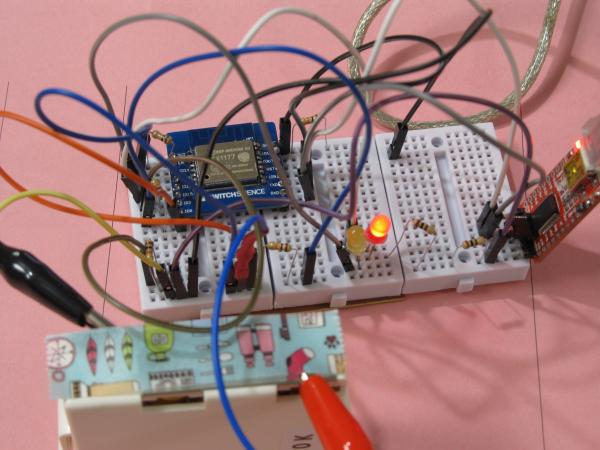
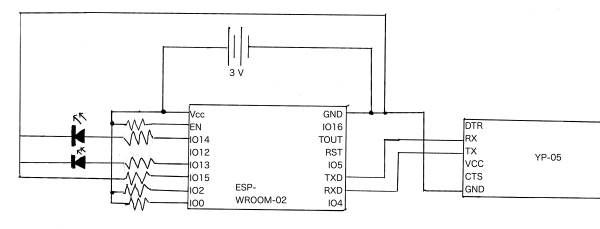

# とある初心者の動的Lチカ（Blink）

ESP-WROOM-02と気象庁の予報で作りたいお天気ライト

## はじめに

とある日の深夜、とあるDiscordサーバーにて同人誌に一節書いてみないかと誘われ、初心者でもいいならということでヒョコヒョコとやって参りました、hiyokoと申します。初心者の視点から表題にもある私の積み基板を使いつつ、一風変わったLチカをしたときの体験を書いていきます。

## 作りたいもの
その日、傘が必要かどうかを、なんらかの形で告知してくれるデバイスを作りたいと思い、とりあえずブレッドボード上に試作しようと思いました。とりあえず今回は天気のとおりに光るところまでで、定時取得などは後日にしようと思います。

### インサイト

- 技術的に難しいものでないこと
- こちらが何もしなくても近くにさえいればわかるもの
- 関係ないときに、音や見た目がうるさくないこと
- 傘が必要か分かること

### 実は、完成済みの作例がある

実はすでにネット上には一種の完成形が存在します。各種LCDやマトリックスLEDに天気や気温などを表示するものです。GAFAMのG社やA社から発売されている画面付きスマートスピーカーも、必要な機能としては条件を満たすかもしれません。

今回私が作りたいものにとても近いものをCL様という方が既に６年ほど前に作られています。[^CL2015]また、スイッチサイエンス様のECサイトには、次回入荷のステータスが未定となっていますがキットの販売ページが存在します。[^SWITCHSCIENCE2017]

しかしそれらは、真似するには技術や設備が明らかに足りなかったり、私の用途にはオーバースペックであったりするものでした。なので、動作の流れなどをパク……リスペクトしつつ進めていきました。

## 計画
以上を踏まえ、実際に試みる仕様を決めました。

まず、天気予報の取得には気象庁のAPIっぽいもの[^TOYODA2021]又はそれをLivedoor Weather Hacksと互換性のあるようにラッピングしているToroshima様（tsukumi様）作のAPI[^tenkiyohoapi2020]をGoogleAppScript（以下、GAS）からfetchし、必要な情報のみにします。どこまでGAS側で処理し、どこからマイコン側で処理するかは作りながら検討することとしました。マイコン側のデータ取得はGASのプログラム側にdoGet()を用意しておくつもりです。

使う部材についてはESP-WROOM―02と単色LED2〜3本を中心に作ることにし、LEDの光り方で表示することにしました。3本足などのRGB LEDなども考えましたが、必要な時間帯以外はそもそも光っていなくてよく、IOも余裕があることからわざわざプログラムを煩雑にせずともLEDの数を増やし、消費電力の観点から常時点灯機能も作りません。LED部分に単色で良いのでカラーのものを導入すればCL様の作品[^CL2015]のように既成品の照明器具の中にも組み込めますし、電子ペーパーを導入すれば電源供給無しで提示し続けることもできるでしょう。どこまで行っても傘が必要かどうかしか示せませんが。

インターネットアクセスのためのSSIDなどの情報はハードコーディングせず、何らかの形であとから設定する形にしました。

## 作業開始

まずはESP-WROOM-02をブレイクアウトボードにはんだ付けしていきます。この時、IO16のグランドを剥がしてしまいました。まさかの2極目でこの失敗、先が思いやられます。面倒臭がらずにペーストハンダやハンダ吸い取り線を買いに行けば良かったなと後悔しましたが、特別なピンではなかったので続行しました。最後に修復を試みましたが被害が拡大しそうだったため諦め、そのままです。どうにかこうにか、他のピンのハンダ付けも完了しました。

次にブレッドボードに装着します。しかし、ここでも問題が発生します。手持ちのブレッドボードではその全幅を使ってしまうのです。今までは立体的なタイプしか買わずに横着していたためブレッドボード用の平たいタイプのジャンパーワイヤは在庫がありません。ブレッドボード同士のみで合体させようにも何故か歪んでしまいます。最終的にはちょうどいい大きさの未使用のユニバーサル基板（茶色い板）に2つ固定することにしました。

その後は平和に回路を作成していき、ついにコンピュータとシリアル変換越しに接続でき、ESP恒例の文字化けしたBootメッセージもシリアルモニタから確認できました。ようやく動作確認にこぎつけました。

フラッシュモードでの起動を確認できたため、試しに`AT`と送ってみました。

## ATコマンドが通らない

いままでも問題しか起きていませんが、更に問題が発生します。いいえ、些細なことを私の技量不足が問題にします。

送信したATがどこかに消えるのです。しかもよく見たらreadyの表示も出ていません。考えられる原因としては、よく聞く電流不足かと思いました。その時はただのATコマンドぐらいなら無線も使わないだろうしFTDIのシリアル変換からの電源でも問題ないだろうと考え、そこから電源をとっていたためです。

ダイソーの最安マンガン電池２本に切り替えたところうまく行きました。ちゃんとReadyが表示されたのです。また、ATと打ったらモニタ側にもATと表示されました。これは快挙だったはずでした、その後にOKでなくErrorが送られてくるということさえなければ。

電源電圧を測ったところ2.9Vまで落ちていたり、謎にリセットがかかったりしていたことが原因と推測しました。そこで、アルカリ２本の直列を２つ並列にした４本体制にもしましたが、電源電圧こそ3.1v以上に回復したもののあまり状況は変わらず…。その他にCH340系など別のシリアル変換なども用いてみましたが結局解決しませんでした。インターネットで検索してみてもそこで詰まったという投稿は見られなかったため、おそらく普通は書くまでもなく対処してしまうか、普通は発生しないということなのかなと思いました。なお、AT以外のATコマンド、AT+GMRなども試してみましたが。ことごとく無慈悲なErrorが帰ってくるのみでした。


## 動作確認リベンジ

次の日、特になにか考えがあったわけではなくただ、前の日と同じようにつないでみたところ、何故か動いたのです。これは大変不思議でした。しかし、このマイコン自体少々動作に不思議な点のあるものなので気にしないことにしました。

確認したコマンドはすべてATコマンドで、最終的にじWi-Fiネットワークへ参加したり、SoftAPを立ち上げて普通のデバイスをそこへ参加させることまでできました。[^ATコマンドの動作確認]

この後はArduinoのスケッチを書き込んでいくのですが、私はここで初期ファームのバックアップを忘れてしまいました。他に予備があったりネット上にあったりするのでどうしても困ることはないと思いますが、個人的にはこういう系はとっておく派だったため少しショックでした。

## GoogleAppsScript

気を取り直して、今度はGAS上でうごかすプログラムを作っていきます。また、天気予報の取得は気象庁のサーバーから直接取得することにしました、傘が必要かどうかを機械的に判断するプログラムを基本的には自力で作ることにしたため、livedoor互換である必要がないためです。しかし、読みにくいJsonなのでlivedoor互換の方を利用するのも賢い選択の一つだと思います。セルフホストもできるようです。[^tsukujima2020]

今回はGAS上で処理できる部分はなるべくGASで処理をし、気象庁からデータを取得する部分とマイコンからの問い合わせに答える部分は別のfuntionとすることにしました。ミスをした時により直しやすいのはGASの方であること、午前中に出かける時に傘が必要か見たいのみであり内部的な天気の取得は１日に一回朝5時の予報で十分であることからです。また、テストがてらマイコン側は何回も試行したい、一緒にする意味がない、一つのことをうまくやるの精神が好きなどの理由もあります。

## Arduino/ESP-WROOM-02

まずはじめにWi-Fiの設定のためスケッチを拝借してきました。WiFi Managerというライブラリもあるらしいのですがそのへんを使うと処理が完全に追えなくなるためスケッチ内で処理するものをそのままコピペして利用しました。[^exabugs2016]また、GASを使ってSpreadsheetのデータを取り出すという主旨の作例があり、今回は考え方は異なるもののやりたいことは同じなためそれも拝借してきました。[^ABK282021]ここまではほぼコピペです。最終的には定時実行できるようにしたいですが、とりあえず今回は`delay`で300,000ミリ秒遅延させることで連続リクエストしないようにしています。

ここから唯一ちゃんとArduinoの自分で書いた部分です。ledのピン番号を（constの）変数としておいて、`pinMode`と`digitalWrite`で共に`OUTPUT`と`LOW`をセットする関数、GASから帰ってきた情報をもとにLEDを光らす関数をセットし、それぞれ`void setup()`と`void loop`の中に置きました。[^ifを使ってないのがこだわり]
```
void hage_setup(){
  pinMode(ledRain, OUTPUT);
  pinMode(ledSunny, OUTPUT);
  digitalWrite(ledRain, LOW);
  digitalWrite(ledSunny, LOW);
}
void hage(){
  umbrella = (body.indexOf("t")) + 1;
  digitalWrite(ledRain, umbrella);
  digitalWrite(ledSunny, !umbrella);
}
```
ちなみに、判定方法がおかしいのはtrue/falseの前後に謎の数字がゴミでついてきてしまい、取得時の処理が理解できない私には取り除けなかったためです。初心者コピペの弊害です。

## 部品をセット〜動作

**動いた！！**はんだ付けが必要な箇所も前章で終わっており、ブレッドボードに刺しただけで流石に書くこともないので、完成した写真と回路図のようなものを部品中心に書き起こしてみたものを下に示しておきます。




## 感想など

今回チャレンジしたものは、作りはじめの時点では「原因不明の何かにより失敗」に終わると思っていました。実際、この原稿の最初の版ではATコマンドが通らなかったところで終わっています。しかし、原因不明の何かは原因不明に解決し最終的に動作までこぎつけました。もうすこし取得間隔を伸ばせば実用も不可能では無いようなものが出来上がり、私自身も驚いています。部品と時間が足りていないため完成には至っておりませんが、いくつかの部品（メスピンヘッダ等）が届き次第完成形にしたいと思います。

[^tweet]

また、今回のチャレンジは電子工作のみならず、それ以上にこの原稿がとてもチャレンジングな試みでした。本は読むもの、で暮らしてきた私にとってこのような原稿を書くというのはどうにも実感が沸きません。しかし、初心者目線での話であればなんとか書けてしまうということが今回分かり、作例や新しい話は難しいという方も是非書いてみてほしい、そのような本を読んでみたいと思いました。もともと同人誌というのは権威のある科学誌などとは異なり同好の士が集い、作り上げ消費するのが基本です。もちろん高度な内容のものやとてもニッチなものもありますし、単独発行が（内容や採算的に）難しいのは私も同じです。しかし、誰か信頼できそうな人に誘われたときは（可能であれば）断らずに是非参加してみて欲しいと初参加者の感想として思います。ソロには限界があるから[^SAOのパクリ]。単３電池の極性の見分け方の話から始まる超初心者向けの本と、一通りのことはマスターしていることが前提の中上級者向けの本、その間を埋める意味合いでもとても意味のあるものだと私は思います。（もちろん、単３電池の極性の見分け方の話から始まる初心者向け同人誌もいいと思います。）

## 参考文献

ABK28(2021)『Google Spreadsheetを管理テーブルにした、ESP8266タイマースイッチ（AC） - Qiita』 https://qiita.com/ABK28/items/60aef868b61a48e0e715 （2021年11月22日閲覧）

CL(2015)『ESP-WROOM-02で玄関お出かけ天気カラー照明灯 - M.C.P.C. (Mamesibori Creation Plus Communication)』https://cl.hatenablog.com/entry/esp-wroom-02-weather-light (2021年11月19日閲覧)

exabugs(2016)『ESP8266 (ESP-WROOM-02) でWi-Fi使用時のSSID/パスワードをブラウザで設定できるように - Qiita 』 https://qiita.com/exabugs/items/2f67ae363a1387c8967c （2021年11月22日閲覧）

せかいい(2021)『せかいい on Twitter: "え、ちょっと待って完成したんだけど！？え！？！？" / Twitter』 https://twitter.com/Jewel_Flash/status/1462814517910405120 （2021年11月23日閲覧）

SWITCH SCIENCE(2017)『i-Weather（アイウェザー）～玄関先で天気を知らせてくれるIoT～ - スイッチサイエンス』https://www.switch-science.com/catalog/3270/ （2021年11月19日閲覧）

天気予報 API（livedoor 天気互換） (2020)『天気予報 API（livedoor 天気互換）』https://weather.tsukumijima.net/ （2021年11月19日閲覧） 

TOYODA Eizi（2021）『TOYODA Eizi on Twitter: "一番伸びてるのはこれかしら。仕様の継続性や運用状況のお知らせを気象庁はお約束していないという意味で、APIではないと申し上げざるを得ないのですが、一方で政府標準利用規約に準拠してご利用いただけます。" / Twitter』https://twitter.com/e_toyoda/status/1364504338572410885 （2021年11月19日閲覧）

tsukujima (2020) 『GitHub - tsukumijima/weather-api: 天気予報 API（livedoor 天気互換）』 https://github.com/tsukumijima/weather-api

他、各種データシート等。

## 追伸

分圧回路って、その電圧になる仕組みは分かるけど、マイコンとかの動力源にしていいものなのでしょうか。あと、いい加減ちゃんとした大きさのブレッドボードが欲しくなってきたのでおそらく近いうちに買います。多分。

<!---
引用用？注釈？↓↓
--->


[^ABK282021]:ABK28(2021)『Google Spreadsheetを管理テーブルにした、ESP8266タイマースイッチ（AC） - Qiita』 https://qiita.com/ABK28/items/60aef868b61a48e0e715 （2021年11月22日閲覧）

[^CL2015]:CL(2015)『ESP-WROOM-02で玄関お出かけ天気カラー照明灯 - M.C.P.C. (Mamesibori Creation Plus Communication)』https://cl.hatenablog.com/entry/esp-wroom-02-weather-light (2021年11月19日閲覧)

[^exabugs2016]:exabugs(2016)『ESP8266 (ESP-WROOM-02) でWi-Fi使用時のSSID/パスワードをブラウザで設定できるように - Qiita 』 https://qiita.com/exabugs/items/2f67ae363a1387c8967c （2021年11月22日閲覧）

[^tweet]:せかいい(2021)『せかいい on Twitter: "え、ちょっと待って完成したんだけど！？え！？！？" / Twitter』 https://twitter.com/Jewel_Flash/status/1462814517910405120 （2021年11月23日閲覧）

[^SWITCHSCIENCE2017]:SWITCH SCIENCE(2017)『i-Weather（アイウェザー）～玄関先で天気を知らせてくれるIoT～ - スイッチサイエンス』https://www.switch-science.com/catalog/3270/ （2021年11月19日閲覧）

[^tenkiyohoapi2020]:天気予報 API（livedoor 天気互換） (2020)『天気予報 API（livedoor 天気互換）』https://weather.tsukumijima.net/ （2021年11月19日閲覧） 

[^TOYODA2021]:TOYODA Eizi（2021）『TOYODA Eizi on Twitter: "一番伸びてるのはこれかしら。仕様の継続性や運用状況のお知らせを気象庁はお約束していないという意味で、APIではないと申し上げざるを得ないのですが、一方で政府標準利用規約に準拠してご利用いただけます。" / Twitter』https://twitter.com/e_toyoda/status/1364504338572410885 （2021年11月19日閲覧）

[^tsukujima2020]:tsukujima (2020) 『GitHub - tsukumijima/weather-api: 天気予報 API（livedoor 天気互換）』 https://github.com/tsukumijima/weather-api


<!---
それ以外の注釈
--->

[^ATコマンドの動作確認]:`AT`の他に、`AT+GMR`、`AT+CIPSTAMAC`、`AT+CWMODE`、`AT+CWLAP`、`AT+CWJAP`、`AT+CWQAP`を確認しました。

[^ifを使ってないのがこだわり]:ifを使ってないのがこだわり。思ったよりも簡潔に書けて満足している。

[^SAOのパクリ]:TVアニメ『ソードアート・オンライン』１期第２話のキリトのセリフのパクリ